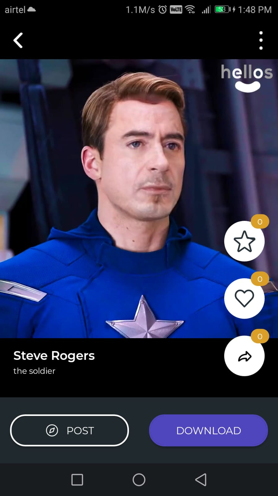

# [**Hellos App**](https://hellos.ai/)

This Readme consist documentation of code according to screens in the hellos mobile app. Hellos mobile app is written in react native which is a javascript based cross platform mobile app development framework.

- [**Hellos App**](#hellos-app)
  - [**Screens**](#screens)
    - [**Splash**](#splash)
    - [**Video Tutorial**](#video-tutorial)
    - [**Login**](#login)
    - [**Forgot Password**](#forgot-password)
      - [**OTP**](#otp)
      - [**Reset Password**](#reset-password)
    - [**Create Account**](#create-account)
      - [**Username**](#username)
      - [**More Detail**](#more-detail)
      - [**Verify Phone Number**](#verify-phone-number)
    - [**Photo Click**](#photo-click)
    - [**Language**](#language)
    - [**Dashboard**](#dashboard)
      - [**Home Tab**](#home-tab)
        - [**Video Details**](#video-details)
        - [**Swap Loader**](#swap-loader)
        - [**Video Details Swapped**](#video-details-swapped)
      - [**Explore Tab**](#explore-tab)
      - [**Profile Tab**](#profile-tab)

## **Screens**
Screens consist of the Screen based brief explaination for each screen in production with link to its code in codebase.

### **Splash**

Splash Screen consist of our logo and a vector image. [**CODE**](./app/Root/Screens/SplashScreen/)

### **Video Tutorial**

Video Tutorial consist of a tutorial video for first time users and a get started button which
takes to [Login Screen](#login). [**CODE**](./app/Root/Screens/VideoTutorialScreen/)

### **Login**

Login Screen consist of mobile number based authentication, forgot password OTP based with twilio integration, login button and bottom bar to go to [Create Account Screen](#create-account). [**CODE**](./app/Root/Screens/LoginScreen/)

### **Forgot Password**

This Screen takes your mobile number to send the OTP for resetting password. [**CODE**](./app/Root/Screens/ForgotPasswordScreen/)

#### **OTP**

OTP Screen to take OTP and reset password button. [**CODE**](./app/Root/Screens/OtpScreen/)

#### **Reset Password**

Reset your password and it will take you to the [Login Screen](#login). [**CODE**](./app/Root/Screens/ResetPasswordScreen/)

### **Create Account**

Create Account consist of a vector image and simple create account button which takes you to the [Username Screen](#username) and the bottom navigation. [**CODE**](./app/Root/Screens/InfoScreen/)

#### **Username**

Username Screen lets you select an unique username for your account and then you an move to [More Detail Screen](#more-detail) by clicking GO. [**CODE**](./app/Root/Screens/SignupScreen/)

#### **More Detail**

More Detail page takes you mobile number for otp authentication and lets you create password. This screen also contains all the terms and coditions page which is a [webview element](app/Root/Screens/WebView/WebView.js) and proceed button which will take you to the [Verify Phone Number Screen](#verify-phone-number). [**CODE**](./app/Root/Screens/SignupMoreDetails/)

#### **Verify Phone Number**

Verify your phone number by authenticating the OTP you get and it will take you to [Login Screen](#login). [**CODE**](app/Root/Screens/SignupScreen4/)

### **Photo Click**

This screen asks you to click photo of yourself or select from gallery. [**CODE**](app/Root/Screens/PhotoClickScreen/)

### **Language**

User select their preffered language in which thwy want to have video content in app. [**CODE**](app/Root/Screens/Language/)

### **Dashboard**
Dashboard consists of 3 Tabs [Home Tab](#home-tab), [Explore Tab](#explore-tab) and Profile Tab with a bottom navigation to switch to the above given tabs. [**CODE**](app/Root/Screens/DashboardScreen/)

#### **Home Tab**

Home is the main home screen where the user will land after login it consists of different sections with different categories. [**CODE**](app/Root/Screens/DashboardScreen/HomeTab/)

##### **Video Details**

This screen will appear to user when they click on any video on [Home Tab](#home-tab). It consist of one report option in options, saved video button, like video button, list of faces they have with add button to add more which will take them to [Photo Click Screen](#photo-click) and a swap button to start swap which will take them to [Swap Loader Screen](#swap-loader). [**CODE**](app/Root/Screens/VideoDetailsScreen/)

##### **Swap Loader**

Swap Loader screen is a normal loader screen which is there for the wait time of swap to happen also a cancel button is there if user want to cancel the swap which will take them to [Video Details](#video-details). [**CODE**](app/Root/Screens/VideoDetailsScreen/SwapVideoLoader.js)

##### **Video Details Swapped**

Video Details Swapped screen will appear afer the swap is completed on [Swap Loader](#swap-loader) screen. Now it have swapped video and save, like, share, post button to post to public view in explore screen and download button to save in the mobile gallery. [**CODE**](app/Root/Screens/VideoDetailsScreen/)

#### **Explore Tab**

Explore Tab have a wall with categories which you can use to sort accordingly. [**CODE**](app/Root/Screens/DashboardScreen/ExploreTab/)

#### **Profile Tab**

Profile Tab consist of all user based data with their all faces, swapped videos, saved videos and liked videos. User can also edit ther profile from here. [**CODE**](app/Root/Screens/DashboardScreen/ProfileTab/)